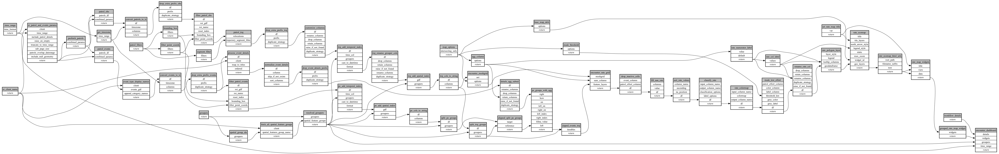

```
# AUTOGENERATED BY ECOSCOPE-WORKFLOWS; see fingerprint in README.md for details

```

```yaml
# fingerprint:
artifacts_sha256_basic: 4850147fbf15f80d3ea35c70dd224916c8883ace53f405e3c110136b719b1188
artifacts_sha256_strict: 93b964abffd081fd67358bb60d283b4919ed85d800558fb82323d2e59644876d
installed_requirements:
- channel: https://repo.prefix.dev/ecoscope-workflows/
  name: ecoscope-platform
  version: {version: ==2.23.0}
- channel: https://repo.prefix.dev/ecoscope-workflows-custom/
  name: ecoscope-workflows-ext-custom
  version: {version: ==0.1.1}
- channel: conda-forge
  name: pydeck
  version: {version: ==0.9.2}
params_sha256: e1ea454a1a2d5c496da341bd918c3019433cc46fbc2efadee039d25c36eeda4c
spec_sha256: d78d78fbf1aa80c9bec03a3d66fd1f17e72f6aec362bf08ebfe90ccc00286be4

```

# ecoscope-workflows-patrol-encounter-rate-map-workflow


